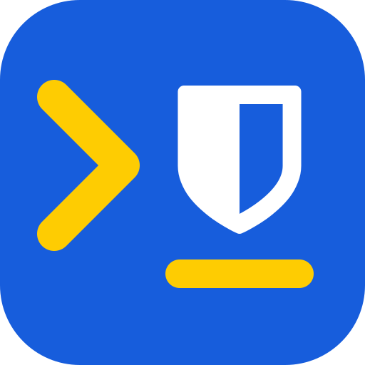

#  bw-broker

Programs ask for Bitwarden secrets by name. A pinentry dialog shows which program asks for what, and entering the master password approves it. The approved secrets are then cached for that one process for up to 15 minutes of idle time.

```sh
bw-broker get github-token                  # login password, printed raw
bw-broker get github-token/username npm/totp  # JSON object, name -> value
bw-broker get 'test[username1]'             # the item "test" whose username is username1
bw-broker forget github-token               # drop this program's approval of one secret
bw-broker forget                            # drop all of this program's approvals
bw-broker type github-token                 # type the password into the focused password field
bw-broker type --keyboard github-token      # type with a virtual keyboard, for apps without an input method
bw-broker type --into Teams github-token    # refuse unless the focused window's title or app id contains 'Teams'
bw-broker list test                         # the usernames of the items named "test"
bw-broker search github work                # items whose metadata contains every word
bw-broker mail-otp --to you@gmail.com --from github.com   # wait for a code mailed by github.com and type it
bw-broker mail-otp --to you@gmail.com --print             # exactly one code from any sender, printed
```

`type` prints nothing secret. Without `--keyboard` it goes through the Wayland input method, which only types into a text field that is focused and has reported itself, and a password goes only into a field that reports itself as a password field. `--keyboard` types into whatever has focus, so it checks the focused window but not the field. Both stop if focus moves to another window. Electron apps do not work with the input method, even with `--enable-wayland-ime`, so they need `--keyboard`. `--into WINDOW` on `type` and `mail-otp` refuses before the prompt when the focused window does not match, so a value meant for one app does not go to whatever the user clicked last.

`list` and `search` return names, URIs and folders, never values. The first one a program runs asks for the master password; after that its queries show an approve/deny dialog for 15 minutes of idle time, until rbw's vault copy changes. The first query after a sync that changed an item asks for the password again. `search` matches names, URIs, usernames, folders, custom field names and text field values. It does not match notes or hidden fields.

`forget` only affects the program that runs it. To clear every program's approvals, restart the agent: `systemctl --user restart bw-brokerd`.

Every request is logged by name, never by value: `journalctl --user -u bw-brokerd`.

A name is `item`, `item/field`, `item[user]` or `item[user]/field`. `\` escapes `/`, `[`, `]` and `\` that are part of a name.

The reasoning behind every choice, including what this does not protect against, is in [docs/decisions.md](docs/decisions.md).

## Setup (NixOS + home-manager)

```nix
# flake inputs
bw-broker = {
  url = "git+https://github.com/AlexanderReaper7/bw-broker";
  inputs.nixpkgs.follows = "nixpkgs";
};

# home-manager
imports = [ inputs.bw-broker.homeManagerModules.default ];
services.bw-broker = {
  enable = true;
  email = "you@example.com";
  targetCpu = "znver5";  # optional
};
```

After switching, run `bw-broker login`. It runs `rbw login` and then `rbw lock` even if the login fails or is interrupted, because login leaves rbw-agent unlocked. Do the same whenever rbw asks for a new login. Do not run `rbw unlock`: see the vault section of the decisions.

`mail-otp` needs a [Google app password](https://myaccount.google.com/apppasswords) in a hidden custom field on each Google login item whose inbox it may read, the same field name on every one, and the module option `mailLogin = "google.com/bw-broker-imap";` naming it without `[user]`. `--to ADDRESS` picks the item whose username is ADDRESS.

## API keys

One key per consumer, stored as a hidden custom field named after the consumer on the service's login item, and labelled with the same name at the provider: `openrouter.ai/t3-codex`. The reasoning is in the decisions.

A program that runs a command for its token can call the client directly. For codex, `timeout_ms` has to cover the approval dialog, which waits up to 120 s; the default of 5 s is too short:

```toml
[model_providers.openrouter.auth]
command = "/etc/profiles/per-user/alexander/bin/bw-broker"
args = ["get", "openrouter.ai/t3-codex"]
timeout_ms = 130000
```

## Layout

- `src/bin/bw-broker.rs` is the client.
- `src/bin/bw-brokerd.rs` is the daemon: socket, request flow, cache sweeping.
- `src/process.rs` finds the requesting process.
- `src/cache.rs` holds approved secrets per instance.
- `src/vault.rs` unlocks rbw's vault copy and decrypts values.
- `src/typing.rs` types into the focused window: input method, virtual keyboard, focus checks.
- `src/mail.rs` reads Gmail over IMAP and picks out one-time codes for `mail-otp`.
- `src/prompt.rs` builds the pinentry dialog.
- `src/secret_ref.rs` parses secret names.
- `examples/type-probe.rs` tests typing live without the vault: `cargo run --example type-probe -- [--password|--keyboard] TEXT`.
- `examples/mail-probe.rs` tests `mail-otp` without the agent, reading the app password from stdin.
- `nix/` has the package and the home-manager module.

## License

bw-broker is licensed under the GNU Affero General Public License, version 3 only ([LICENSE](LICENSE)). Copyright (c) 2026 Alexander Öberg.
